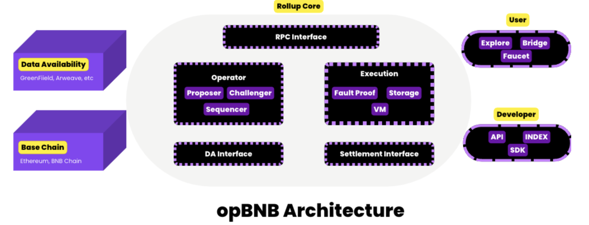

:::caution 
This is a living document and is susceptible to changes. 
:::

## Architecture of opBNB

The opBNB is a layer 2 scaling solution built on top of BSC (a layer 1 blockchain). It processes transactions off-chain but posts transaction data on-chain, providing scalability as compressed layer 2 transaction data are posted on-chain. It has three main layers: an RPC service layer for interacting with the rollup, an operator interface layer for proposing layer 2 transactions off-chain, and an execution layer for executing transactions and providing an EVM execution environment. 

The rollup has a modular design, so the data availability interface and settlement layer can be implemented with different solutions. The data availability layer can be replaced with solutions like Greenfield, Arweave, and others, instead of relying only on BSC. Likewise, the settlement layer can be replaced with other EVM-compatible chains besides BSC, such as the Ethereum mainnet. 

The rollup is secured by its settlement chain as transaction data is posted on-chain, benefits from its consensus, and uses its data availability solutions. It is decentralized and permissionless. The rollup provides faster and cheaper transactions than BSC while still being secured.

